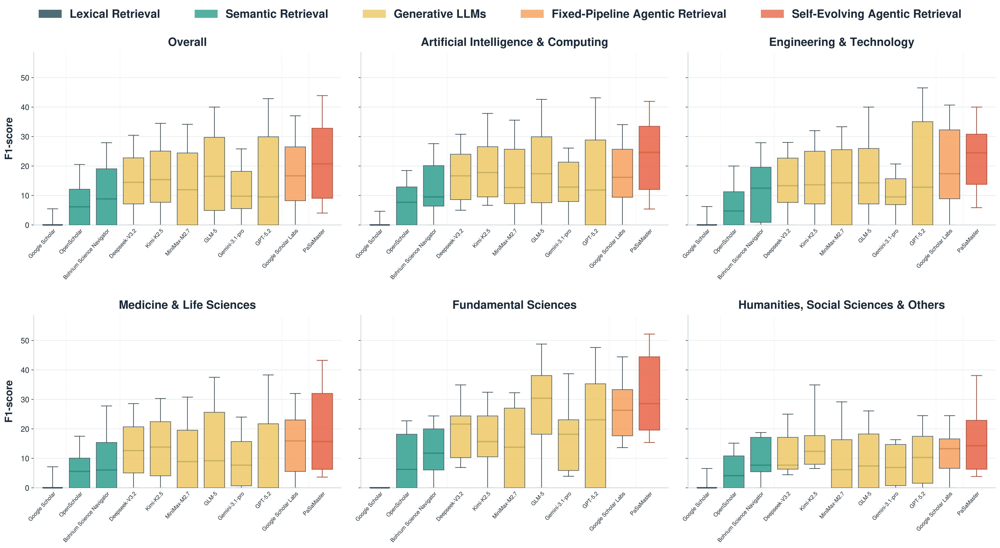
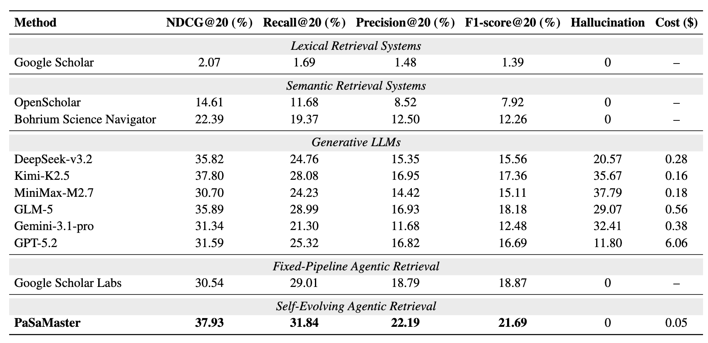

<div align="center">
  <h1>
    
    PaSaMaster
  </h1>

  <p><strong>Towards Self-Evolving Agentic Literature Retrieval</strong></p>

  <p>
    <a href="https://scimaster.bohrium.com/home">Website</a> |
    <a href="https://arxiv.org/pdf/2605.14306">arXiv Paper</a> |
    <a href="https://www.npmjs.com/package/scimaster-cli?activeTab=readme">CLI / MCP Tool</a>
  </p>

  
</div>

## Resources

| Resource | Link |
|----------|------|
| Website | [scimaster.bohrium.com/home](https://scimaster.bohrium.com/home) |
| Paper | [arXiv:2605.14306](https://arxiv.org/pdf/2605.14306) |
| CLI / MCP | [`scimaster-cli` on npm](https://www.npmjs.com/package/scimaster-cli?activeTab=readme) |

## Overview

PaSaMaster is a self-evolving agentic literature retrieval system for high-quality scientific paper search and relevance ranking. It iteratively analyzes user intent, retrieves candidate papers, evaluates evidence, and produces relevance-scored recommendations grounded in real sources.

PaSaMaster is designed for both human researchers and AI agents that need reliable literature retrieval instead of shallow keyword matching or hallucinated references.

## Highlights

| Capability | What PaSaMaster Provides |
|------------|--------------------------|
| Agentic retrieval | Iterative query understanding, retrieval, and ranking for complex research intents. |
| Evidence-grounded results | Paper recommendations are tied to real retrieved sources, reducing citation hallucination. |
| High-quality ranking | Relevance-scored paper lists across broad scientific domains. |
| Agent-ready tooling | CLI and MCP server support through `scimaster-cli`, enabling direct integration into custom agents. |

## Try PaSaMaster

Use PaSaMaster online at [https://scimaster.bohrium.com/home](https://scimaster.bohrium.com/home). After opening the website, select **Literature Search**, enter your research question in the input box, and submit it to retrieve relevant papers.

Read the paper: [PaSaMaster on arXiv](https://arxiv.org/pdf/2605.14306).

## PaSaMaster CLI for Agentic Literature Retrieval

PaSaMaster can also be used from the command line through [`scimaster-cli`](https://www.npmjs.com/package/scimaster-cli?activeTab=readme), a SciMaster literature-search CLI powered by PaSaMaster. It provides both a `sci` command for direct terminal searches and a `sci-mcp` Model Context Protocol (MCP) server that can be plugged into your own agents, Claude Code, Cursor, or any MCP-compatible client.

This makes PaSaMaster available as a literature retrieval tool inside agent workflows. An agent can call `search_papers` with a research query and receive a structured, high-quality set of relevant papers, including metadata, abstracts, URLs, and BibTeX entries. This is useful for research assistants, review-writing agents, paper recommendation systems, and other literature-aware AI applications that need stronger recall and relevance ranking than simple keyword search.

### Quick Start

Install and run:

```bash
npm install -g scimaster-cli
sci init
sci search "CRISPR gene editing 2024" --limit 20 --mode low
```

Use it without installation:

```bash
npx -y scimaster-cli@latest search "machine learning protein" --limit 20
```

### MCP Integration

Register PaSaMaster as an MCP tool for your own agent:

```json
{
  "mcpServers": {
    "scimaster": {
      "command": "npx",
      "args": ["-y", "scimaster-cli"]
    }
  }
}
```

The MCP server exposes the following tool:

| Tool | Description |
|------|-------------|
| `search_papers` | Searches for relevant papers with `query`, `limit`, and `mode`, returning structured paper results for downstream agent reasoning. |

## Evaluation

Evaluated on the PaSaMaster Benchmark across 38 scientific disciplines, PaSaMaster substantially improves over traditional keyword retrieval and generative LLM baselines, achieving stronger relevance ranking, zero source hallucination, and competitive performance at a fraction of the computational cost.

<div align="center">
  
</div>

## Citation

If you find PaSaMaster useful, please cite:

```bibtex
@article{du2026towards,
  title={Towards Self-Evolving Agentic Literature Retrieval},
  author={Du, Yuwen and Jin, Tian and Kang, Jing and Pang, Xianghe and Chai, Jingyi and Miao, Tingjia and Liu, Fenyi and Wang, WenHao and Yao, Sikai and Zhang, Yuzhi and others},
  journal={arXiv preprint arXiv:2605.14306},
  year={2026}
}
```
